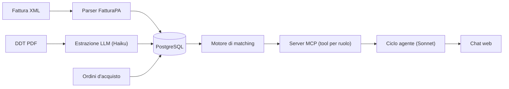

# Invoice Reconciliation Agent

English version: [README.md](README.md)

Un agente AI che confronta le fatture dei fornitori con DDT e ordini d'acquisto (three-way matching), spiega le anomalie in linguaggio semplice e, solo per gli utenti autorizzati, approva o blocca le fatture. L'agente lavora tramite un server MCP i cui tool sono filtrati in base al ruolo dell'utente.


## Il problema

Prima di pagare un fornitore, l'ufficio amministrativo verifica che tre documenti combacino:

| Documento | Dice | Formato tipico in Italia |
|---|---|---|
| Ordine d'acquisto | Cosa abbiamo ordinato | Gestionale |
| DDT | Cosa è arrivato davvero | PDF o carta scansionata |
| Fattura | Cosa ci fanno pagare | XML FatturaPA via SDI |

Spesso il controllo si fa a mano, riga per riga. Esempio dai dati demo: 25 interruttori fatturati, 20 consegnati, 62,50 € a rischio.

## Cosa fa

- Legge le fatture XML FatturaPA con codice deterministico (niente LLM: i dati sono già strutturati)
- Estrae i dati dei DDT in PDF, anche scansionati, con Claude, restituendo dati strutturati e validati
- Esegue un matching deterministico a tre vie e calcola l'importo a rischio di ogni anomalia
- Espone i dati tramite un server MCP: i tool visibili dipendono dal ruolo dell'utente
- Esegue il ciclo dell'agente nel backend (Claude sceglie i tool, il backend li esegue via MCP) dietro una chat web
- Applica le regole di approvazione nel codice e registra ogni decisione in un log di audit
- Valuta precisione e costo dell'estrazione su più modelli per scegliere quello giusto

## Architettura



## Scelte progettuali

| Scelta | Perché |
|---|---|
| LLM solo dove serve | L'XML si legge con il codice; l'LLM legge i DDT non strutturati e parla con l'utente. Il matching è codice: esatto, testabile, verificabile |
| Output strutturato con tool forzato + validazione Pydantic | Il modello può rispondere solo nello schema previsto, e i dati non validi vengono scartati invece che salvati |
| Tool discovery filtrata per ruolo | Il server MCP viene creato per ruolo: un viewer non riceve mai i tool di approvazione, quindi né il modello né un prompt injection possono chiamarli. Il ruolo è fissato lato server, mai passato come argomento di un tool |
| Regole di business fuori dal modello | Approvare una fattura con anomalie richiede una motivazione scritta. Controllo nel codice (difesa in profondità, anche dietro MCP), vincolo nel DB, registrazione in `audit_log` |
| Errori di business leggibili, errori interni nascosti | Il modello riceve le violazioni delle regole ("serve una motivazione") e può chiedere all'utente; le eccezioni impreviste non vengono esposte |
| Un modello per compito, scelto con una valutazione | Haiku per l'estrazione (stessa precisione misurata a circa un terzo del costo), Sonnet per l'agente |
| Sicurezza di base | Parsing XML protetto da XXE (`defusedxml`), caso di test di prompt injection, HTML delle risposte ripulito, segreti solo nel `.env`, limiti sulla dimensione dei file |

## Valutazione

8 DDT: 4 standard più una scansione (ruotata, sfocata, solo immagine), una data scritta a parole con virgola decimale, un riferimento d'ordine assente (il modello deve restituire null, non inventarlo) e una nota con prompt injection. I valori attesi sono scritti a mano.

| Modello | Precisione campi | Documenti perfetti | Costo (8 DDT) | Tempo medio |
|---|---|---|---|---|
| Claude Haiku 4.5 | 100% | 8/8 | 0,037 $ | 3,5 s |
| Claude Sonnet 5 | 100% | 8/8 | 0,117 $* | 3,5 s |

\* Stima a 3 $ / 15 $ per milione di token; verificare il listino attuale.

Conclusione: su questi documenti Sonnet non porta vantaggi misurabili, quindi l'estrazione usa Haiku. Il 100% di entrambi indica anche che il dataset non distingue i modelli: servono documenti reali (scritte a mano, più pagine, foto da telefono) per trovarne i limiti.

Report completo: [`reports/extraction_eval.json`](reports/extraction_eval.json). Si esegue con `uv run python scripts/eval_extraction.py`.

## Ruoli

| Utente demo | Ruolo | Può |
|---|---|---|
| Giulia Rossi | viewer | Consultare fatture, ordini e riconciliazioni |
| Marco Bianchi | operator | Anche approvare e bloccare fatture |

## Stack

Python 3.12, FastAPI, SQLAlchemy 2, Alembic, PostgreSQL 17 (Docker), Pydantic, API Anthropic (Claude Haiku 4.5, Claude Sonnet 5), SDK MCP Python v2, defusedxml, pytest, uv. Frontend: una pagina HTML con JavaScript senza framework, marked e DOMPurify.

## Avvio in locale

Requisiti: Docker, [uv](https://docs.astral.sh/uv/), una chiave API Anthropic.

```bash
git clone https://github.com/nicolaltafini/invoice-reconciliation-agent.git
cd invoice-reconciliation-agent
cp .env.example .env                      # compila DB_USER, DB_PASSWORD, ANTHROPIC_API_KEY
docker compose up -d
uv sync
uv run alembic upgrade head
uv run python -m reconciliation.seed      # fornitori e ordini demo
uv run python scripts/load_samples.py     # fatture e DDT di esempio (4 chiamate LLM)
uv run uvicorn reconciliation.main:app --port 8001
```

Chat: http://127.0.0.1:8001/chat. Documentazione API: http://127.0.0.1:8001/docs. Test: `uv run pytest`.

## Struttura

```
src/reconciliation/
  fatturapa.py       Parser XML FatturaPA
  ddt_extraction.py  Estrazione DDT con Claude
  matching.py        Regole di matching a tre vie
  approvals.py       Regole di approvazione e audit
  mcp_server.py      Server MCP, tool filtrati per ruolo
  agent.py           Ciclo dell'agente (Claude + tool MCP)
  *_api.py           Endpoint FastAPI
  static/chat.html   Chat web
migrations/          Migrazioni Alembic
samples/             Fatture, DDT e dataset di valutazione
scripts/             Caricamento esempi, valutazione, verifiche
tests/               Test
```


## Limiti noti

- **Nessuna autenticazione**: il selettore dell'utente demo non è un login. In produzione l'utente arriverebbe dall'SSO aziendale; il resto del meccanismo dei ruoli resterebbe identico.
- **Valutazione piccola e sintetica**: 8 documenti generati danno un'indicazione, non una misura statisticamente solida. L'agente in sé non è ancora valutato.
- **Matching per codice articolo**: si assume che i codici del fornitore coincidano con quelli del cliente. Se una riga supera sia la quantità ordinata sia quella consegnata, i due importi a rischio si sommano e gonfiano il totale.
- **Controllo duplicati DDT dopo l'estrazione**: ricaricare un DDT costa comunque una chiamata LLM. Un hash del file controllato prima della chiamata lo risolverebbe.
- **Copertura del parser**: solo il primo `FatturaElettronicaBody`, solo fornitori con `Denominazione`, solo il primo riferimento a ordine e DDT.
- **Privacy dei dati**: documenti e risultati dei tool vengono inviati all'API Anthropic. Con dati aziendali reali va valutato prima dell'uso.

## Autore

Nicola Altafini, studente ITS AI Developer & Data Analyst a Verona. [LinkedIn](https://www.linkedin.com/in/nicolaltafini)