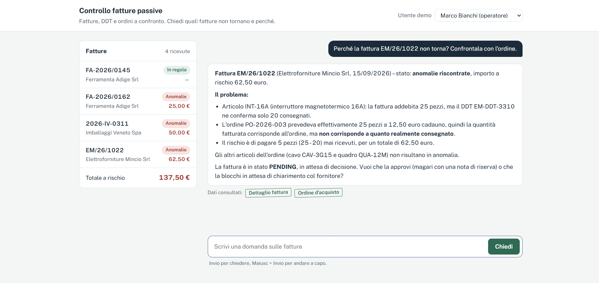
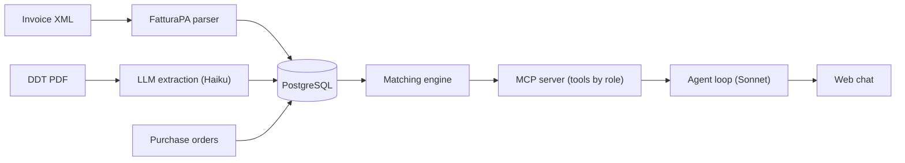

# Invoice Reconciliation Agent

Versione italiana: [README.it.md](README.it.md)

An AI agent that checks supplier invoices against delivery notes and purchase orders (three-way matching), explains discrepancies in plain language and, for authorized users only, approves or blocks invoices. The agent works through an MCP server whose tools are filtered by the user's role.



## The problem

Before paying a supplier, accounts payable checks that three documents agree:

| Document | Says | Typical format in Italy |
|---|---|---|
| Purchase order | What we ordered | ERP record |
| Delivery note (DDT) | What actually arrived | PDF or scanned paper |
| Invoice | What we are charged | FatturaPA XML via SDI |

This is often done by hand, line by line. Example from the demo data: 25 circuit breakers invoiced, 20 delivered, 62.50 EUR at risk.

## What it does

- Parses FatturaPA XML invoices deterministically (no LLM: the data is already structured)
- Extracts delivery notes from PDF, including scans, with Claude, returning validated structured data
- Runs a deterministic three-way match and computes the amount at risk for every discrepancy
- Exposes the data through an MCP server; the tools each user can see depend on their role
- Runs an agent loop in the backend (Claude chooses tools, the backend executes them via MCP) behind a web chat
- Enforces approval rules in code and records every decision in an audit log
- Evaluates extraction quality and cost across models to choose the right one

## Architecture



## Key design decisions

| Decision | Why |
|---|---|
| LLM only where it adds value | XML is parsed with code; the LLM reads unstructured DDTs and talks to the user. Matching is plain code: exact, testable, auditable |
| Structured output via forced tool use + Pydantic validation | The model can only answer in the expected schema, and invalid data is rejected instead of stored |
| Role-based tool discovery | The MCP server is built per role: a viewer never receives the approve/block tools, so neither the model nor a prompt injection can call them. The role is set server-side, never passed as a tool argument |
| Business rules outside the model | Approving an invoice with discrepancies requires a written reason. Checked in code (defense in depth, even behind MCP), constrained in the DB, recorded in `audit_log` |
| Readable business errors, hidden internal errors | The model receives rule violations ("a reason is required") so it can ask the user; unexpected exceptions are not exposed |
| One model per task, chosen by evaluation | Haiku for extraction (same measured accuracy at about a third of the cost), Sonnet for the agent |
| Security by default | XXE-safe XML parsing (`defusedxml`), prompt-injection test case, sanitized HTML for agent output, secrets only in `.env`, file size limits |

## Evaluation

8 delivery notes: 4 standard ones plus a scan (rotated, blurred, image only), a date written in words with a decimal comma, a missing order reference (the model must return null, not invent it), and a prompt-injection note. Expected values are written by hand.

| Model | Field accuracy | Perfect documents | Cost (8 docs) | Avg time |
|---|---|---|---|---|
| Claude Haiku 4.5 | 100% | 8/8 | $0.037 | 3.5 s |
| Claude Sonnet 5 | 100% | 8/8 | $0.117* | 3.5 s |

\* Estimated at $3 / $15 per million tokens; check current pricing.

Takeaway: on these documents Sonnet brings no measurable gain, so extraction uses Haiku. Both scoring 100% also means the dataset does not separate the models: real documents (handwriting, multiple pages, phone photos) are needed to find their limits.

Full report: [`reports/extraction_eval.json`](reports/extraction_eval.json). Run it with `uv run python scripts/eval_extraction.py`.

## Roles

| Demo user | Role | Can |
|---|---|---|
| Giulia Rossi | viewer | Read invoices, orders and reconciliation results |
| Marco Bianchi | operator | Also approve and block invoices |

## Tech stack

Python 3.12, FastAPI, SQLAlchemy 2, Alembic, PostgreSQL 17 (Docker), Pydantic, Anthropic API (Claude Haiku 4.5, Claude Sonnet 5), MCP Python SDK v2, defusedxml, pytest, uv. Frontend: one HTML page with vanilla JavaScript, marked and DOMPurify.

## Run locally

Requirements: Docker, [uv](https://docs.astral.sh/uv/), an Anthropic API key.

```bash
git clone <repo-url>
cd invoice-reconciliation-agent
cp .env.example .env                      # fill DB_USER, DB_PASSWORD, ANTHROPIC_API_KEY
docker compose up -d
uv sync
uv run alembic upgrade head
uv run python -m reconciliation.seed      # demo suppliers and purchase orders
uv run python scripts/load_samples.py     # sample invoices and delivery notes (4 LLM calls)
uv run uvicorn reconciliation.main:app --port 8001
```

Chat: http://127.0.0.1:8001/chat. API docs: http://127.0.0.1:8001/docs. Tests: `uv run pytest`.

## Project structure
src/reconciliation/
fatturapa.py FatturaPA XML parser
ddt_extraction.py DDT extraction with Claude
matching.py Three-way matching rules
approvals.py Approval rules and audit log
mcp_server.py MCP server, tools filtered by role
agent.py Agent loop (Claude + MCP tools)
*_api.py FastAPI endpoints
static/chat.html Web chat
migrations/ Alembic migrations
samples/ Demo invoices, DDTs and evaluation dataset
scripts/ Sample loading, evaluation, checks
tests/ Unit tests


## Known limitations

- **No authentication**: the demo user selector is not a login. In production the user would come from company SSO; the rest of the role mechanism would stay the same.
- **Small synthetic evaluation**: 8 generated documents give an indication, not a statistically solid measure. The agent itself is not evaluated yet.
- **Matching by item code**: supplier codes are assumed to match the buyer's codes. If a line exceeds both ordered and delivered quantities, the two amounts at risk add up and overstate the total.
- **Duplicate DDT check happens after extraction**, so re-uploading costs an LLM call. A file hash checked before the call would fix it.
- **Parser scope**: first `FatturaElettronicaBody` only, suppliers with `Denominazione` only, first order and DDT reference only.
- **Data privacy**: documents and tool results are sent to the Anthropic API. With real company data this needs a review before use.

## Author

Nicola Altafini, ITS AI Developer & Data Analyst student in Verona. [LinkedIn](https://www.linkedin.com/in/nicolaltafini)